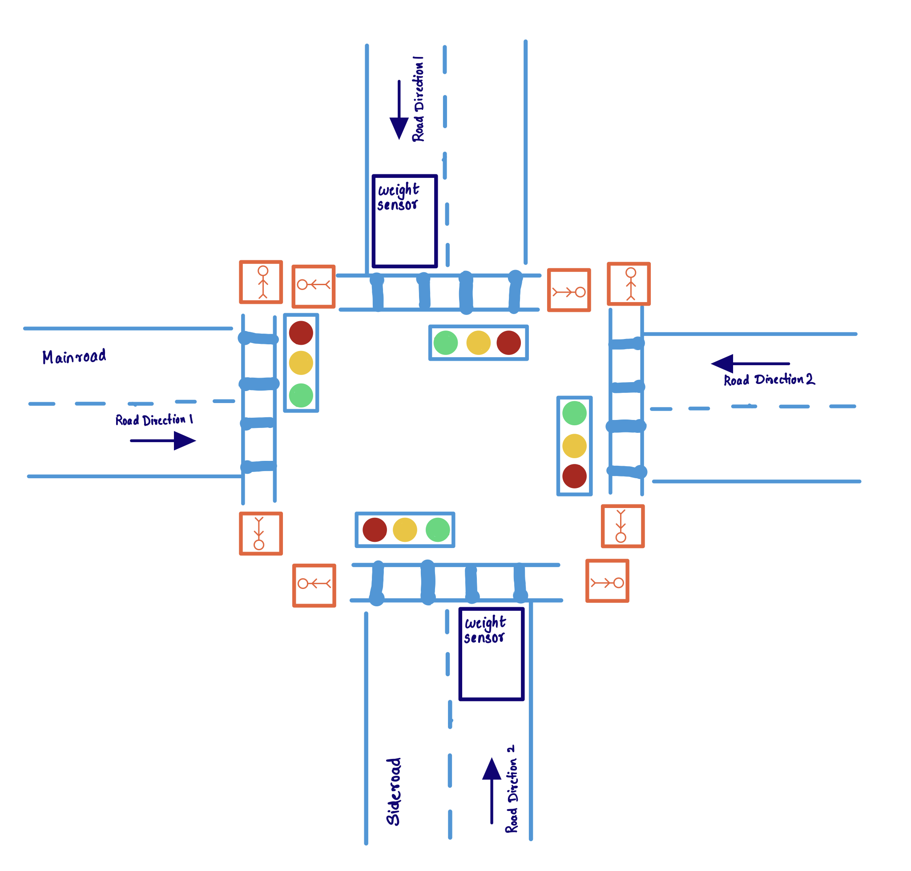

# Assignment 1

## 1. Order Pizza from Dominos

### Objects and Behaviors:

```
PizzaOrderingService:
    Data: menu, location, storeHours, isAcceptingOrders, orderComplete
    Behavior: authenticateUser, payment, getUserAddress, pickNearbyStore, addToCart, confirmOrder, 
    assignOrderToDeliverBoy, notifyOrderPickedUp
```

```
User:
    Data: name, address, nearbyStore, orderType, creditCardInfo
    Behavior: loginToPizzaService, provideAddress, provideZip, selectOrderType, pickPizzas, 
    makePayment, pickUp
```
```
DeliveryBoy:
    Data: name
    Behavior: pickUpOrder, deliverOrder
```

### Sequence of Flow - Invoke Objects with Behaviors

```
User Ben;
DeliveryBoy David;
PizzaOrderingService Dominos;
authorized = Ben.loginToPizzaService(Dominos){
 Dominos.authenticateUser(this)
}
if(authorized is true){
    Ben.selectOrderType()
    if(Ben.orderType is Delivery){
        if(Ben.address is empty){
            Ben.provideAddress();
        }
    }
    else{
        Ben.nearbyStore = Dominos.pickNearbyStore(Ben.provideZip())
    }
    //Order
    Ben.selectedFood = Ben.pickPizzas(Dominos.menu)
    //Addtocart
    Dominos.addToCart(Ben.selectedFood)
    //Payment
    Ben.makePayment(){
        Dominos.processPayment(Ben.creditCardInfo)
    }
    //Check payment received or not
    confirmed = Dominos.confirmOrder(){
        if(currentTime within Dominos.storeHours && Dominos.isAcceptingOrders)
            return true  
    } 
    if(confirmed){
        if(Ben.orderType is Delivery){
            David = Dominos.assignOrderToDeliveryBoy();
            David.pickUpOrder(Dominos){
                Dominos.notifyOrderPickedUp()
            }
            David.deliverOrder(Ben.address)
            Dominos.orderComplete
        }
        else{
            Ben.pickUp();
            Dominos.orderComplete
        }
    }
    else
        error
}
```

## 2. Design a platform for buying tickets of local events.
#### User can:
1. View events by filtering date and location
1. Initiate Checkout
    1. Either Sign-up/ Log-in(if already a user)/ or continue as guest
    1. Payment
1. Cancel
```
Class: User
Data: name, phone, email, isMember, preferredEventDate, preferredEventLocation, order, selectedEvent, creditCardInfo
Behavior: 
selectFromFilteredEvents(){
    filteredEventsByUserPreferences = App.filterEvents(User.preferredEventDate, User.preferredEventLocation);
    //Render UI with available filtered events
    User.selectedEvent = UI.selectedEvent;
}

initiateCheckout(){
    if(isMember){
        User = dbConnection.getUser(userEmail, userpassword);
    }
    else{
        User = UI.userInputDetails;
        if(signUp){
            dbConnection.saveUser(User);
            this.isMember = true;
        }
        else{
            //continue as guest - No action required, User details are already available.
        }
    }
    payment()
}
payment(){
    isPaymentSuccess = App.processPayment(User)
    if(isPaymentSuccess)
        App.notifyUser(User);   
    else
        Error;
}
cancel(){
    App.orderEnd(this);
}

```
```
Class: Event
Data: name, description, eventDate, eventTime, eventLocation, eventTicketPrice
Behavior:
```
```
Class: App
Data: eventsList
Behavior: 
filterEvents(preferredEventDate, preferredEventLocation){
    filteredEventsByUserPreferences = dbConnection.getFilteredEvents(preferredEventDate, preferredEventLocation);
    return filteredEventsByUserPreferences;
}
processPayment(User){
    isPaymentSuccess = User.creditCardInfo.securePayment(User.selectedEvent.eventTicketPrice)
    User.order = User.selectedEvent;
    return isPaymentSuccess;
}
notifyUser(User){
    //email user with the order details
    sendEmail(User.email, User.order);
}
sendEmail(email, order){
    smtpAPI.send(email, order);
}
orderEnd(User){
    alert(User);
    User.order = null;
}
```
```
Class: CreditCard
Data: type, bankName, cardNumber, address, securityCode, expiryDate
Behavior:
securePayment(eventTicketPrice){
    isCardValid = checkCardValidity(this.expiryDate)
    if(isCardValid is true)
        //eventTicketPrice is charged to credit card
        bankAPI.chargeToCreditCard(this,eventTicketPrice)
        return true
    else
        return false
}
checkCardValidity(){
    Date currentDate = new Date();
    return currentDate.compareTo(expiryDate);
}
```

## 3. Design a Car Rental System.

#### User can:
1. Check availability by providing 
    1. Pick-up and return location
    1. Pick-up and return date and time
    1. Renter age(25+)
    1. Vehicle class
1. Pick a vehicle from available vehicle list
1. Review
    1. Provide contact details - Name, Phone number, address
    1. Provide Driver's License details - Issuing State, Expiry date, LicenseID
1. Payment(if approved)
1. Cancel

//Add extra $50 for 25+ age
```
Class: User
Data: name, age, phone, email, address, licenseID, issuingState, expiryDate, order, preferredPickUpLocation,
preferredReturnLocation, preferredPickupDateTime, preferredReturnDateTime,  
selectedCar, totalRentalAmount, creditCardInfo

Behavior:
selectFromAvailableCars(){
    filteredCarsByUserPreference = App.filterCars(User)
    //Render UI with available filtered cars
    User.selectedCar = UI.selectedCar;
}
Review(){
    isValidUser = App.reviewUserDetails(User);
    if(isValidUser){
        payment();
    }
    else
        Error;
}

payment(){
    isPaymentSuccess = App.processPayment(User)
    if(isPaymentSuccess)
        App.notifyUser(User);   
    else
        Error;
}
cancel(){
    App.orderEnd(this);
}
```
```
Class: Car
Data: licesePlate, make, model, color, type, rentalPricePerDay, isCarAvailable
Behavior:
```
```
Class: App
Data:
Behavior:
filterCars(User){
    //Populate the list of cars vailable based on the filters provided by the user
    dbConnection.getFilteredCars(User.preferredPickUpLocation, User.preferredReturnLocation, 
    User.preferredPickupDateTime, User.preferredReturnDateTime, User.Age);
    return filteredCarsByUserPreference;
}
reviewUserDetails(User){
    isValid = deptOfLicensingAPI.isValidUser(licenseID, issuingState, expiryDate);
    return isValid;
}
processPayment(User){
    List<String> order;
    User.totalRentalAmount = calculateTotalRentalAmount(User);
    order.add(User.selectedCar);
    order.add(User.preferredPickUpLocation);
    order.add(User.preferredReturnLocation);
    order.add(User.preferredPickupDateTime);
    order.add(User.preferredReturnDateTime);
    order.add(User.totalRentalAmount);
    User.order = order;
    isPaymentSuccess = User.creditCardInfo.securePayment(User.totalRentalAmount);
    return isPaymentSuccess;
}
calculateTotalRentalAmount(User){
    noOfDays =  User.preferredReturnDateTime - User.preferredPickupDateTime
    noOfDays = (noOfDays equals 0)? 1 : noOfDays
    rentalAmount = (noOfDays * User.selectedCar.rentalPricePerDay);
    if(User.age < 25){
        rentalAmount += 50;
    }
    return rentalAmount;
}
notifyUser(User){
    //email user with the order details
    sendEmail(User.email, User.order);
}
sendEmail(email, order){
    smtpAPI.send(email, order);
}
orderEnd(User){
    alert(User);
    User.order = null;
}
```
```
Class: CreditCard
Data: type, bankName, cardNumber, address, securityCode, expiryDate
Behavior:
securePayment(totalRentalAmount){
    isCardValid = checkCardValidity(this.expiryDate)
    if(isCardValid is true)
        //totalRentalAmount is charged to credit card
        bankAPI.chargeToCreditCard(this, totalRentalAmount)
        return true
    else
        return false
}
checkCardValidity(){
    Date currentDate = new Date();
    return currentDate.compareTo(expiryDate);
}
```

## 4. Design a Parking lot.
#### Payment Kiosk can:
* Calculate the payment amount for the duration provided by the user.
* Provide receipt after payment, to be displayed on the car dashboard.

#### ParkingDisplayBoard can: 
* Displays the number of free parking spots
 
```
Class: User
Data: phone, parkingReceipt, parkingDuration, creditCardInfo, vehicle
Behavior:

checkParkingAvailability(ParkingLot){
    ParkingDisplayBoard.showAvailableSpotsCount(ParkingLot);
    //User parks at an available spot.
}
provideInputs(){
    park the car and provide the required input at the payment kiosk
    User.parkingDuration = UI.parkingDuration;
    User.creditCardInfo = UI.creditCardInfo;
    User.vehicle.licensePlate = UI.licensePlate;
}

initiatePayment(ParkingLot) {
    if(!ParkingLot.isFull) {
        //Provide duration 
        isPaymentSuccess = PaymentKiosk.processPayment(User);
        if(isPaymentSuccess)
            PaymentKiosk.printReceipt(User);
            ParkingLot.usedParkingSpots += 1;
        else
            Error;
    }
}
```
```
Class: parkingReceipt
Data: receiptNo, issuedAt, receiptAmount, duration, licensePlate, vehicle
Behavior:
isExpired(){
    if(dateTime.now() > (issuesAt + duration))
        return true;
    else
        return false;
}
```
```
Class: ParkingLot
Data: name, lovation, isFull, totalParkingSpots, usedParkingSpots
Behavior:
```
```
Class: vehicle
Data: licensePlate
Behavior:

```
```
Class: ParkingDisplayBoard
Data:
Behavior:
showAvailableSpotsCount(ParkingLot){
    App.reclaimExpiredSlots(ParkingLot);
    //Display the count of available free parking spots
    if(isFull){
        show("Parking is full")
    }
    else{
        show(ParkingLot.totalParkingSpots - ParkingLot.usedParkingSpots + "parking spots available");
    }
}
```
```
Class: PaymentKiosk
Data: name, phone, creditCardInfo, parkingReceiptsList
Behavior:
processPayment(User){
    User.parkingReceipt.receiptAmount = calculateTicketAmount(User);
    User.parkingReceipt.receiptNo = randomIdGenerator() //Randomly generates receiptNo
    User.parkingReceipt.issuedAt = Time.Now();
    User.parkingReceipt.duration = User.parkingDuration;
    User.parkingReceipt.licensePlate = User.vehicle.licensePlate;
    isPaymentSuccess = User.creditCardInfo.securePayment(User.parkingReceipt.receiptAmount);
    parkingReceiptsList.add(User.parkingReceipt);
}
calculateTicketAmount(User){
    if(User.parkingDuration <= 2)
        parkingFeeToBePayed = 4
    else{
        parkingFeeToBePayed = 4 + (User.parkingDuration - 2) * 2
    } 
    return parkingFeeToBePayed;
}
reclaimExpiredSlots(parkingLot){
    loop:
    foreach(parkingReceipt in parkingReceiptsList){
           if(parkingReceipt.isExpired()){
                parkingLot.usedParkingSpots -= 1;
            }
    }
    if(parkingLot.usedParkingSpots == totalParkingSpots)
        isFull = true;
    else:
        isFull = false;
}
printReceipt(User){
    //Print receipt
    printerSDK.print(parkingReceipt);
}
```
```
Class: CreditCard
Data: type, bankName, cardNumber, address, securityCode, expiryDate
Behavior:
securePayment(receiptAmount){
    isCardValid = checkCardValidity(this.expiryDate)
    if(isCardValid is true)
        //receiptAmount is charged to credit card
        bankAPI.chargeToCreditCard(this, receiptAmount)
        return true
    else
        return false
}
checkCardValidity(){
    Date currentDate = new Date();
    return currentDate.compareTo(expiryDate);
}
```
## 5. Design a Traffic Controller System for a Junction.
#### Vehicle can:
1. proceed to any of the other 3 roads safely
1. Pedestrians can cross roads safely
1. Left turns should yield and proceed safely


```
Class: Signal
Data: red, green, yellow
Behavior: 
turnOnWarning(){
    red = false;
    green = false;
    yellow = true;
}
turnOnRed(){
    green = false;
    yellow = false;
    red = true;
}
turnOnGreen(){
    yellow = false;
    red = false;
    green = true
}
```
```
Class: Road
Data: roadType, roadDirection1, roadDirection2, crossWalk, signalTime, yellowWaitTime
Behavior:
isVehicleWaiting(){
    if(roadDirection1.isVehicleWaiting() || roadDirection2.isVehicleWaiting){
        return true;
    else
        return false;
}

```
```
Class: RoadDirection
Data: signal, vehicleOnRoadDetectionSensor
Behavior:
isVehicleWaiting(){
    if(this.vehicleOnRoadDetectionSensor.isVehicleWaiting() == true)
        return true
    else
        return false
}

```
```
Class: VehicleOnRoadDetectionSensor
Data: desireWeight, currentWeight
Behavior:
isVehicleWaiting(){
    if(currentWeight > desireWeight)
        return true;
    else
        return false;
}

```
```
Class: CrossWalk
Data: isPushButtonPressed
Behavior:
isPedestrianWaiting(){
    if(isPushButtonPressed is true)
        return true;
    else
        return false;
}
showWalkSign(){
    Display("walk");
}
showHandSign(){
    Display("hand");
}

```

```
Class: SignalManagementSystem
Data: Road mainRoad, Road sideRoad 
Behavior:
manageTraffic(){
    while(true){
        //Assume that the mainroad has green signal all the time unless interrupted by a vehicle waiting to enter the 
        //mainroad or a pedestrian waiting to use a crosswalk on the mainroad
        if(sideRoad.isVehicleWaiting() || mainRoad.isPedestrianWaiting()){
            //Change mainRoad to RED
            mainRoad.roadDirection1.signal.turnOnWarning();
            mainRoad.roadDirection2.signal.turnOnWarning();
            wait(mainRoad.yellowWaitTime);
            mainRoad.roadDirection1.signal.turnOnRed();
            mainRoad.roadDirection2.signal.turnOnRed();
            
            //Flip walk signs            
            mainRoad.crossWalk.showWalkSign();
            sideRoad.crossWalk.showHandSign();

            //Change sideRoad to GREEN and wait 
            sideRoad.roadDirection1.signal.turnOnGreen();
            sideRoad.roadDirection2.signal.turnOnGreen();
            wait(sideRoad.signalTime);
            
            //Change sideRoad to RED
            sideRoad.roadDirection1.signal.turnOnWarning();
            sideRoad.roadDirection2.signal.turnOnWarning();
            wait(mainRoad.yellowWaitTime);
            sideRoad.roadDirection1.signal.turnOnRed();
            sideRoad.roadDirection2.signal.turnOnRed();

            //Flip walk signs 
            sideRoad.crossWalk.showWalkSign();
            mainRoad.crossWalk.showHandSign();

            //Change mainRoad to GREEN
            mainRoad.roadDirection1.signal.turnOnGreen();
            mainRoad.roadDirection2.signal.turnOnGreen();
        }
        else{
            wait(mainRoad.signalTime);
        }
    }       

}

```

